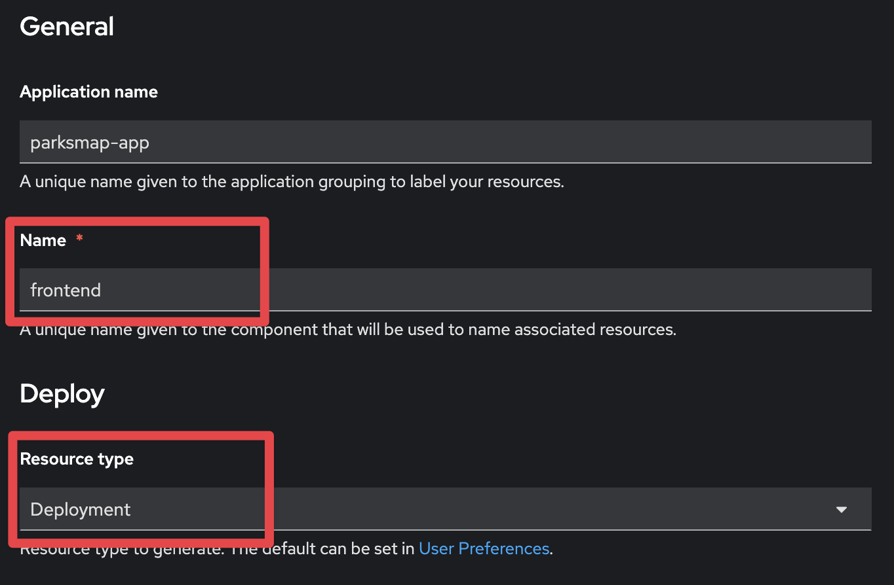
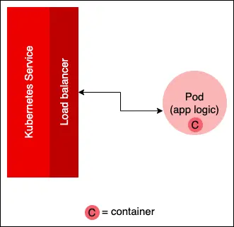
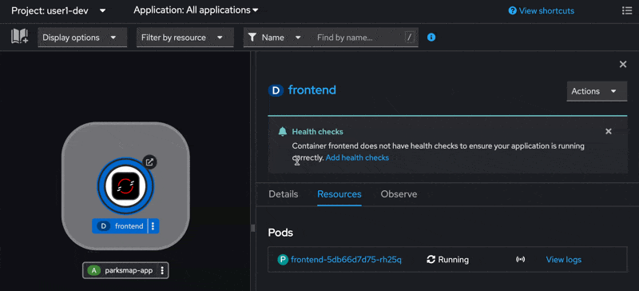

# Outline

### OpenShift Concepts for General Usage (Part 1)
- Tour of the OpenShift web console
- Creating a Project
- Deploying our first containerized application
- Scaling our application
- Attaching persistent stoage

### Overview of OpenShift AI (Part 2)
- Tour of the OpenShift AI Console
- Inspecting a Workbench
- Accessing our Workbench

### Note: The following guide combines elements of two longer workshops. For reference you can find links the respective labs guides below
- [Getting Started with OpenShift for Developers (Part 1)](https://openshift-labs.github.io/starter-guides-html/)
- [OpenShift AI - Parasol Insurance AI Workshop (Part 2)](https://rh-aiservices-bu.github.io/parasol-insurance/modules/index.html)

# Accessing Your Lab (Follow Closely)

Our session today is unique in that we are combining the elements of two longer workshops. Please follow these instructions carefully to ensure you have the following tabs open.
- Access to this lab guide you are reading now
- Access to your OpenShift Console
- Access to your OpenShift AI Console

#### 1. With the provided link. You will be taken to a workshop login page.
- provide your email (will not be preserved)
- provide your workshop password

<p align="center" width="100%">
    
</p>

#### 2. You be will be redirected to a page with a link to lab instructions
- **IMPORTANT**: The below link is NOT the material we are following today, however we still need to access the page to gain access to our OpenShift console in the next step.

<p align="center" width="100%">
    
</p>

#### 3. Access the "Connection and Setup" page from the previous link to take note of your lab username/password and access to your OpenShift AI Console

<p align="center" width="100%">
    
</p>

#### 4. Use your credentials to login to your OpenShift AI Console, you should see something like this.

<p align="center" width="100%">
    
</p>

#### 5. To access you OpenShift Cluster Console, navigate to the icon in the top right. We will use this console for the following excercises.

<p align="center" width="100%">
    
</p>

# Tour of the OpenShift web console

The OpenShift web console is designed to let administrators and developers perform the relevant tasks to their respective roles. Developers execute tasks relevant to installing and configuring applications and services, while administrators ensure that applications operating in a given cluster run efficiently and safely while paying attention to resource allocation and security administration. 

In the web console, OpenShift separates developer tasks from administrator tasks by providing specific visual perspectives for each group. Developers see the Developer perspective. Administrators see the Administrator perspective.

<p align="center" width="100%">
    
</p>


# Creating a Project

In OpenShift, ```Projects``` provide a mechanism for isolating groups of resources within a single cluster. Projects are intended for use in environments with many users spread across multiple teams, or projects.

Your current lab environment, already contains a Project named after your user (userX). Howerver lets create new empty project in which we will deploy our first containerized application.

#### 1. In the Administrator Console, navigate to Home > Projects. Create a project and name it userX-dev (X should be corresond with your user number). Click Create.

<p align="center" width="70%">
    
</p>

#### 2. Once your new project is created, change your view to the Developer console and select your newly created project from the drop down menu.

<p align="center" width="100%">
    
</p>

Great! We now have an empty project in which we can create our first application


# Deploying our first container

In this lesson you will learn:

- How to use a web console to import a Linux container image from a container image repository.
- How to use the web console to get the application up and running from a Linux container.

#### 1. In the Developer Console, navigate to the +Add tab, and select Container Images

<p align="center" width="100%">
    
</p>

#### 2. Add the following text in the Image name from an external registry field:

```
quay.io/openshiftroadshow/parksmap:1.3.0
```
<p align="center" width="100%">
    
</p>

#### 3. Scroll to "General" and add "frontend" under Name. For Resource Type select "Deployment" from the menu. Scroll to the bottom and click "Create."

<p align="center" width="100%">
    
</p>

#### 4. You are now on the Topology page, which will display a circular graphic that represents the application you just installed using a container image.
- This may take a few seconds to for the image to be pulled from the external registry and deployed on the cluster.

<p align="center" width="100%">
    
</p>

#### 5. Access your application in the web browser. You should see an interactive map.

<p align="center" width="100%">
    
</p>


### What did we just do?
1. Pulled a container image from an external registry
2. Deployed a single ```Pod``` (container) with using our pulled image on Openshift
3. Created a ```Service``` and ```Route``` to access our application outside of the cluster. 
    - NOTE: In the previous exercise, OpenShift created the Service and Route for us in a single step. In reality, you may choose to create a Route later, once your application is ready to recieve external traffic.
    

This is one of many ways we can deploy a containerized application on OpenShift. In the next exercise, we will further examine scaling this workload.

# Scaling our application

### What you will learn

- How to access the details pane for an application from the web console Topology view.
- How to increase the number of ```Pods``` in an application using the visual tool in the application detail page.
- How to decrease the number of ```Pods``` in an application using the visual tool in the application detail page.


### Scaling is about increasing or decreasing the number of an application’s pods
Applications running in OpenShift are made up of a variety of Kubernetes components. The component that has an application’s logic is a Kubernetes Pod. A ```Pod``` is a logical unit for organizing a set of one or more Linux containers running in a Kubernetes cluster. These Linux containers house the application’s logic.

For example, imagine you have an application that inspects a .png file to see if the file displays an image of a cat. The logic that does the analysis lives in a container, and that container is in a pod in a Kubernetes cluster. Access to the pod is facilitated by a Kubernetes service that forwards requests to and from between the pod. In a production environment, the service is backed by a load balancer that moves traffic to a pod that has the capacity to process the request.

Figure 1 shows the service/pod architecture for a single pod. Obviously, the load balancer does not have a lot to do because there is only one pod in play

<p align="center" width="100%">
    
</p>

<p style="text-align:center;">Figure 1: Logic for an OpenShift application is represented by a container(s) organized in a Kubernetes pod.
</p>

Typically, an OpenShift application is intended to run code at web scale. This means that an application may be processing hundreds, if not thousands, of requests a minute. In this scenario, it’s not practical to expect one pod to handle such a workload. The way to make it so an application can handle large workloads is to add more pods that have identical logic to the cluster (Figure 2)

<p align="center" width="100%">
    
</p>

<p style="text-align:center;">Figure 2: Scaling an OpenShift application up means adding more pods with identical logic.
</p>

Once more ```Pods``` are added, the load balancer will route a request to the pod that has the capacity to process the given request. Scaling an application down means reducing the number of pods associated with the application.

OpenShift allows you to use the web console to scale up and down the number of pods dedicated to a particular OpenShift application. The following sections describe how to work with the OpenShift web console to scale the number of pods in an application up and down. First, you will use the OpenShift web console to install an application from a container image that is hosted in the quay.io container repository. Then you will use the web console to scale the application’s pod up and down.


### Let's start scaling up

#### 1. Click in the center of the Parksmap circular graphic. An information pane will appear. Select the Details tab
- We see only one Pod is running, lets scale up to 4.

<p align="center" width="100%">
    
</p>

#### 2. The Details tab will show another circular graphic that represents the number of application’s pods running. Use the up and down arrows to the right of the pods graphic to scale the number of pods up or down.

<p align="center" width="100%">
    
</p>


### What did we do?
- Now we have 4 instances of our containerized application running! While this was a manual process, Kubernetes does provide us methods of autoscaling these resources based on demand, however that it outside the scope of our learning today.


# (Optional) Persistent Storage

Most useful applications are "stateful" or "dynamic" in some way, and this is usually achieved with a database or other form of data storage. 

In our scenario, our frontend application is not all too useful showing us a blank map. Ideally we may want this map to show all locations of national parks, like the example below.

<p align="center" width="100%">
    
</p>

To do this, we may have it communicate with a persistent database Pod backed by external storage.

On Openshift, we can leverage persistent storage mechanisms such as ```Persistent Volumes``` and ```Persistent Volume Claims``` to attach real-world storage (NFS, Ceph, EBS, iSCSI, etc) to the ```Pods``` to give them a persistent place to store their data.

This is outside the scope of today's learning. However if you would like to read more about how persistent storage would work in this example. See our extended version of the workshop guide [here](https://openshift-labs.github.io/starter-guides-html/common-workshop-summary.html).


#


# Getting Started with OpenShift AI

### Background

We already have some understanding that containers allow us an easy way to package, distribute, and scale our applications. However in the realm of datascience, OpenShift/kubernetes provides us a convenient framework to:
- define a standard development environment to perform data analysis
- train, test, serve, and scale models in an automated fashion
- establish governance around datascience projects and resource utilization
- dynamically allocate computing power

In the following exercises, we will explore how OpenShift AI, an extension of the OpenShift platform, helps us achieve the above.


#  Access the OpenShift AI console

<p align="center" width="100%">
    
</p>

# Data Science Projects

In Red Hat OpenShift AI (RHOAI), a ```Data Science Project``` is the preferred way to organize resources when working on an AI/ML application. Similarly to how you use projects in OpenShift for other workloads, you can use data science projects to organize the different components that you need for your AI applications.

<p align="center" width="100%">
    
</p>

#### 1. Access the Data Science Projects tab on the left hand side. You may notice that an existing project named after your user (userX) is already created for this exercise.

<p align="center" width="100%">
    
</p>

#### 2. Inside the project, by clicking on the different tabs, you should see a few items that already have been pre-created or configured for you:

<p align="center" width="100%">
    
</p>
    
- These components are as follows:

    - **Workbenches:** a workbench has already been created - this is the environment that you can experiment and train models in. Typically these are pre-built container images that have common datascience stacks pre-installed.

    - **Pipelines:** a pipeline server has already been configured so you can import or run data science pipelines right away. This is outside the scope of today's learning, however you can create on for yourself using the [the full lab guide here](https://rh-aiservices-bu.github.io/parasol-insurance/modules/index.html).

    - **Models:** the models panel is empty at the moment.

    - **Cluster storage:** this is where you find a persistent storage for your workbench and one for the pipeline we will create later.

    - **Data Connections:** it contains all the information needed to connect with an existing S3 storage. We use it to store models and pipeline artifacts.

    - **Permissions:** this is where you can manage the permissions for the project.

#### 3. Navigate to the Workbenches tab. If you click on the arrow next to the workbench, you can see some of the libraries included in it as well as how much resources it has been given.

<p align="center" width="100%">
    
</p>

#### 4. To connect to the workbench, click the Open link:

<p align="center" width="100%">
    
</p>

#### 5. Authenticate with the provided lab credentials, and allow the selected permissions.
- username: userX 
- password: parasol

<p align="center" width="100%">
    
</p>

#### 6. You should now see you pre-configured Jupyter Notebook with some imported experiments. 
- Note the extra folder called parasol-insurance.
- This folder has been cloned from github for you and will be the main working folder for this lab.

<p align="center" width="100%">
    
</p>

#### 7. Navigate to ```parasol-insurance/lab-materials/04/``` directory for a group a various experiments you can run within your workbench
<p align="center" width="100%">
    
</p>

### Where to go next?
[Link to longer form workshop instructions](https://rh-aiservices-bu.github.io/parasol-insurance/modules/index.html)


# Additional learning paths
- [Getting started with OpenShift AI](https://developers.redhat.com/products/red-hat-openshift-ai/getting-started)
- [OpenShift Foundations](https://developers.redhat.com/learn/openshift/foundations-openshift)
